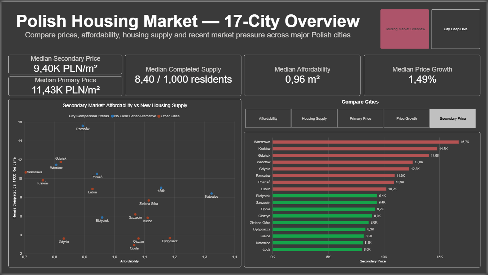
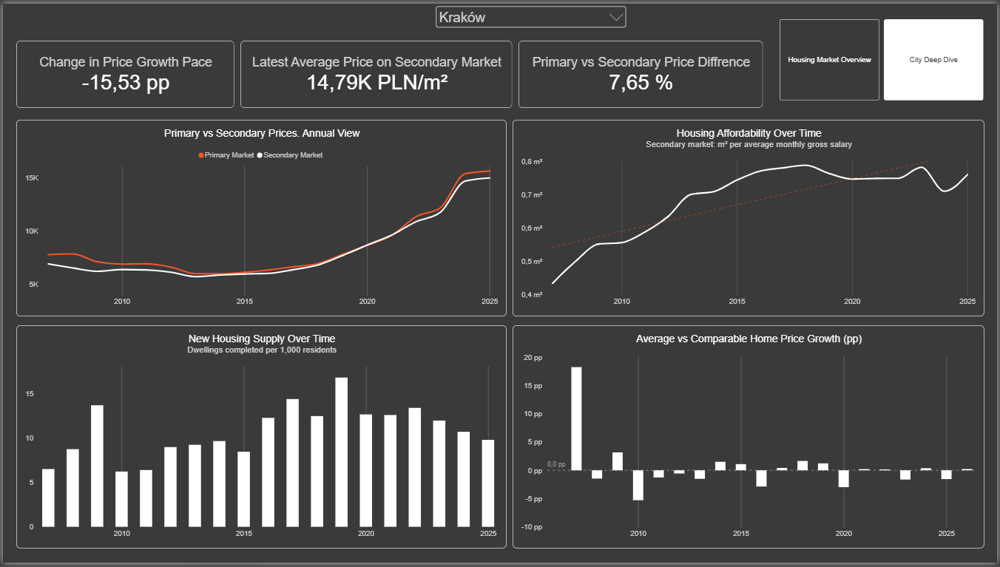
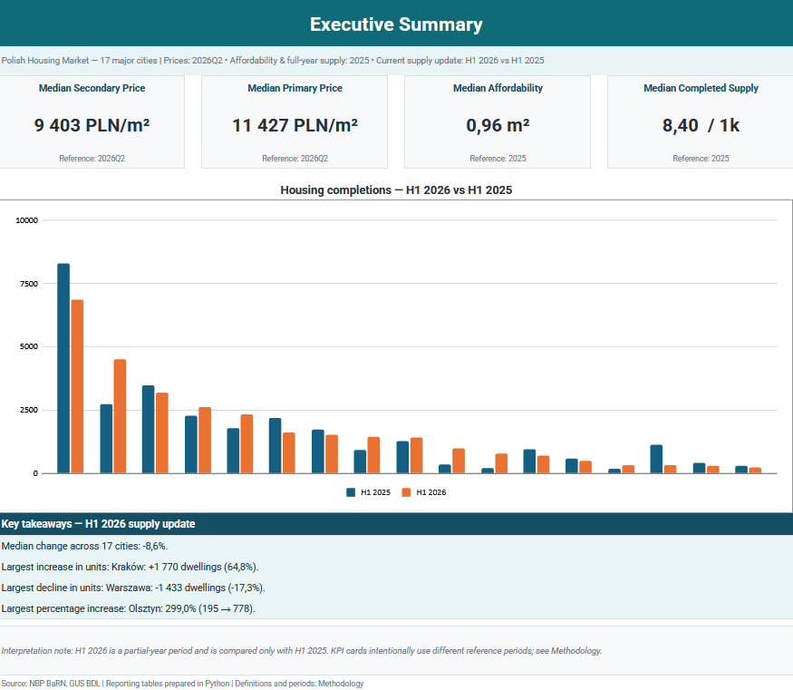
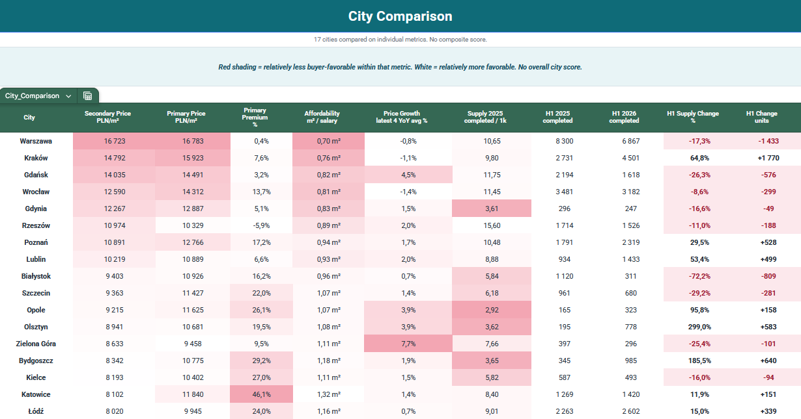

# Housing Market in Major Polish Cities

Housing market analysis for **17 Polish cities**, built with public data from **NBP** and **GUS**.

The project follows the full analytics workflow: raw data validation, cleaning, metric design, exploratory analysis, reporting tables, Power BI and a Google Sheets report.

**Stack:** Python · pandas · NumPy · Matplotlib · Power BI · DAX · Google Sheets  
**Data:** NBP BaRN · GUS BDL  
**Coverage:** prices 2006Q3–2026Q2 · affordability 2007–2025 · full-year housing supply 2005–2025 · H1 2026 update

## Dashboard



**Housing Market Overview** compares cities by prices, affordability, completed housing supply and recent secondary-market price growth.



**City Deep Dive** adds historical prices, affordability, housing supply and average-price vs hedonic growth for a selected city.

Historical supply in Power BI ends at the last complete year, **2025**. The partial H1 2026 update is kept in the spreadsheet report instead.

The Power BI file is available at `powerbi/Polish_Cities_Housing_Market.pbix`.

## Key findings

- **Warszawa remained the most expensive secondary market in 2026Q2** at about **16.7K PLN/m²**, while **Łódź was the cheapest** at about **8.0K PLN/m²**.
- **Affordability improved year over year in 16 of 17 cities in 2025.** Katowice reached about **1.32 m² per average monthly gross salary**, compared with **0.70 m² in Warszawa**.
- **Primary-market premiums differ strongly between cities.** The latest gap was about **+46% in Katowice**, close to zero in Warszawa and **-5.9% in Rzeszów**.
- **Recent secondary-market price growth turned negative in Warszawa, Kraków and Wrocław** when measured as the average of the latest four YoY readings.
- **H1 2026 housing completions fell by 8.6% in the median city.** Kraków added **1,770** completions versus H1 2025, while Warszawa recorded **1,433 fewer**.
- In 2026Q2, **Łódź, Białystok and Szczecin** showed opposite signs for average transaction-price growth and hedonic growth, showing why the mix of homes sold matters.

The latest available period is not the same for every metric. Prices use **2026Q2**, affordability and full-year supply use **2025**, market activity ends in **2024**, and the current supply update compares **H1 2026 with H1 2025**.

## Analysis

The notebooks are organized around seven practical questions:

1. How much does housing cost in each city?
2. Are local wages keeping up with housing prices?
3. How large is the primary vs secondary market price gap?
4. Is recent price growth accelerating or slowing?
5. Which cities are adding the most housing?
6. Which cities look favourable across individual buyer metrics?
7. Does average price growth agree with quality-adjusted price growth?

The project uses separate metrics rather than one composite city score. A three-variable **Pareto check** is used to identify cities with no clearly better alternative across affordability, completed supply and recent secondary-market price growth. The Pareto inputs use each metric's latest valid period, so this is a latest-available comparison rather than a strict same-date cross-section.

## Data pipeline

```text
NBP + GUS raw files
        |
        v
00_validation_cleaning.ipynb
        |
        v
processed/*.csv
        |
        +--------------------+
        |                    |
        v                    v
01_market_questions.ipynb   02_reporting_exports.ipynb
                             |
                             v
                       reporting/*.csv
                          /       \
                         v         v
                    Power BI   Google Sheets
```

### Processed layer

| Table | Rows | Grain |
|---|---:|---|
| `dim_city.csv` | 17 | city |
| `nbp_prices_clean.csv` | 5,440 | city × quarter × market × price type |
| `nbp_hedonic_clean.csv` | 1,280 | geography × quarter |
| `gus_income_clean.csv` | 408 | city × year |
| `gus_market_clean.csv` | 1,020 | city × year × quarter |
| `gus_supply_clean.csv` | 8,772 | city × year × month × supply type |
| `gus_population_clean.csv` | 1,054 | city × year × reference date |

### Reporting layer

`dim_city` · `dim_year` · `dim_nbp_period` · `fact_price_period` · `fact_city_year` · `fact_hedonic_period` · `city_snapshot`

The same reporting layer feeds Power BI and the spreadsheet report.

## Selected pandas work

The source files needed more than a standard `read_csv()` and `groupby()`. NBP stores several price blocks in wide Excel sheets, while GUS uses TERYT codes, cumulative housing-supply series and source-specific missing-value flags.

### Reshaping NBP price blocks

```python
def price_to_long(df, market, price):
    return df.melt(
        id_vars="nbp_period",
        var_name="city",
        value_name="price_pln_m2"
    ).assign(
        market_type=market,
        price_type=price
    )

nbp_prices = pd.concat([
    price_to_long(primary_offer, "primary", "offer"),
    price_to_long(primary_transaction, "primary", "transaction"),
    price_to_long(secondary_offer, "secondary", "offer"),
    price_to_long(secondary_transaction, "secondary", "transaction"),
], ignore_index=True)
```

### Converting cumulative GUS supply into monthly values

```python
out = out.sort_values(["Kod", "Rok", "month"]).copy()
out["cumulative_value"] = out["value"]

previous = out.groupby(
    ["Kod", "Rok"]
)["cumulative_value"].shift()

out["period_value"] = out["cumulative_value"] - previous
out.loc[out["month"].eq(1), "period_value"] = out.loc[
    out["month"].eq(1), "cumulative_value"
]

issue = out["period_value"].lt(0).groupby(
    [out["Kod"], out["Rok"]]
).transform("any")

out["period_value"] = out["period_value"].mask(issue)
```

The pipeline also uses `merge(..., validate=...)`, explicit grain checks and `assert` statements so duplicate keys or unexpected source changes stop the notebook instead of silently changing the result.

## Metric design

### Affordability

```text
average monthly gross wage / annual secondary transaction price per m²
```

The result is the number of square metres corresponding to one average monthly gross salary. It is an annual price-to-income proxy, not a mortgage affordability model.

### Recent price growth

For each city, the dashboard uses the average of the latest **four secondary-market YoY price changes**. It is a descriptive measure of recent price pressure, not a forecast.

### Housing supply per capita

```text
annual completed dwellings / mid-year population × 1,000
```

H1 2026 is kept separate and compared directly with H1 2025 rather than annualized.

### Hedonic comparison

Average transaction-price growth is compared with NBP's hedonic YoY series. Gdańsk and Gdynia stay blank at city level because NBP publishes hedonic data for them only as the `Trójmiasto` aggregate.

## Data quality

The pipeline includes checks for:

- duplicate business keys
- exact 17-city coverage using TERYT
- expected source periods and row counts
- NBP file integrity using SHA-256
- four-quarter completeness before annual price calculation
- GUS `Atrybut` flags such as `x` and `n`
- non-monotonic cumulative housing-supply series
- known NBP methodology breaks for Gdynia
- missing primary-market observations for Opole
- reporting-table foreign keys and grain
- full CSV write/read reconciliation using `pd.testing.assert_frame_equal`

NBP period labels are kept separate from GUS calendar quarters. Cross-source metrics are combined only where the time basis is compatible, mainly at annual level.

Final clean and reporting tables contain **zero duplicate business keys**.

## Google Sheets report

 [Open the Google Sheets report](https://docs.google.com/spreadsheets/d/158lCBVGkFTjF_F3A75yuvtiQ_b_EcPNo/edit?usp=sharing&ouid=113573388264868707337&rtpof=true&sd=true)

Power BI is the main tool for interactive exploration. Google Sheets serves a different purpose: it provides a lightweight browser-based summary that can be opened without Power BI and makes the city-level numbers, definitions and current H1 supply update easy to inspect.



**Executive Summary** contains four reference KPIs and a rule-based H1 2026 vs H1 2025 housing completions update.



**City Comparison** puts all 17 cities in one table across prices, primary premium, affordability, recent price growth and housing supply. Conditional formatting is interpreted within each metric and does not create an overall city ranking.

The workbook has three visible report tabs:

- **Executive Summary:**  four KPIs and the H1 supply update
- **City Comparison:**  city-level comparison table
- **Methodology:** metric definitions, reference periods and caveats

Hidden `src_*` tabs preserve the link to the Python reporting tables. Spreadsheet formulas and the H1 findings were reconciled against the exported CSVs, and the final working Google Sheet was checked for formula errors, header filters and dynamic conditional formatting.

## Methodology notes

- Missing source observations are kept as missing rather than imputed.
- Annual NBP prices require all four quarterly observations.
- H1 2026 supply is a partial-year update and is compared only with H1 2025.
- `city_snapshot` intentionally combines the latest valid period for each metric instead of pretending all metrics share one reference date.
- Offer and transaction prices are separate aggregates and should not be read as a negotiation discount for the same homes.
- Transactions and sold units remain separate GUS measures.
- City-level hedonic values are available for 15 cities; the `Trójmiasto` aggregate is not assigned to Gdańsk or Gdynia.
- Recent price growth and the H1 update are descriptive, not forecasts.

## Repository structure

```text
Polish-Cities-Market-Analysis/
├── data/
│   ├── raw/
│   ├── processed/
│   └── reporting/
├── images/
├── notebooks/
│   ├── 00_validation_cleaning.ipynb
│   ├── 01_market_questions.ipynb
│   └── 02_reporting_exports.ipynb
├── powerbi/
│   └── Polish_Cities_Housing_Market.pbix
├── requirements.txt
└── README.md
```

## Run locally

```bash
git clone <repository-url>
cd Polish-Cities-Market-Analysis
pip install -r requirements.txt
jupyter notebook
```

Run the notebooks in order:

1. `00_validation_cleaning.ipynb`
2. `01_market_questions.ipynb`
3. `02_reporting_exports.ipynb`

Notebook 00 builds the processed layer, notebook 01 runs the market analysis, and notebook 02 creates the reporting model used by Power BI and Google Sheets.

## Sources

- **Narodowy Bank Polski (BaRN)**: housing prices and hedonic indices from the `ceny_mieszkan.xlsx` workbook snapshot stored in `data/raw/nbp/`. Notebook 00 validates this exact snapshot with SHA-256 before processing.
- **GUS Bank Danych Lokalnych (BDL)**:
  - `WYNA_2497` — average gross monthly wages
  - `RYNE_3777` — housing-market transactions
  - `RYNE_3789` — sold dwellings
  - `RYNE_3791` — sold residential area
  - `PRZE_3822` — dwellings started
  - `PRZE_3823` — dwellings completed
  - `LUDN_2914` — population

Raw source snapshots are stored in the repository so the analysis can be reproduced against the same inputs.
